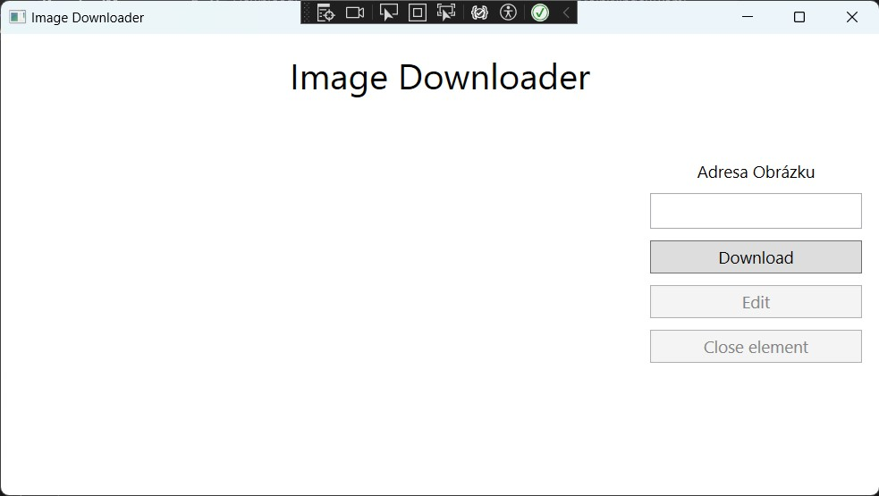
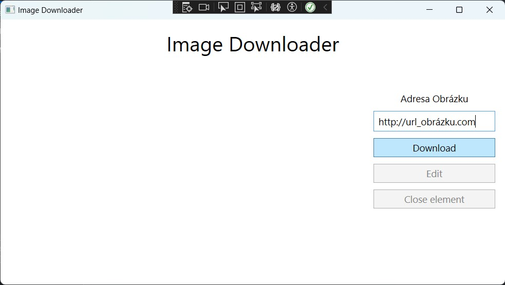
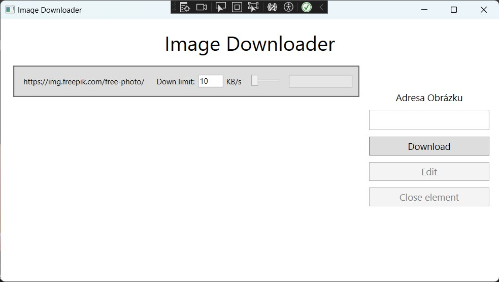
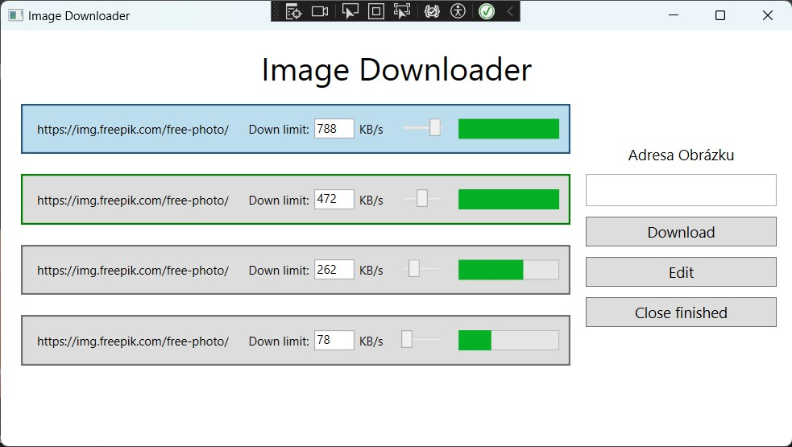
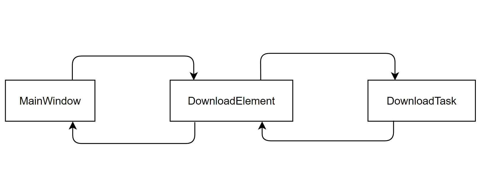

# WPF Async Projekt

# Stahovač Obrázků

## Zadání:
- Vytvořit aplikaci, která při zadání url adresy obrázku, začne její stahování a uložení do souboru.

## Ukázka:

- Vzhled aplikace
---

- Zadání url adresy obrázku
---

- Vytvoření elementu reprezentující stahování
---

- Zakončení stahování a odebrání elementu
---

## Rozvržení funkcionality
### Třídy:
- DownloadTask (Klient) - asynchronní stahování z internetu
- DownloadElement - Zaobalující třída s vizualizací
- MainWindow - ...
---


- Propojení tříd
---

## Tvorba aplikace
1. **XAML design**

- Nejprve si uděláme nějaký jednoduchý XAML design. Může být libovolný, ale musí splňovat:
  - 1 **`StackPanel`** pro generované **`DownloadElementy`**
  - 1 **`TextBox`** pro zadání url adresy
  - 2 **`Buttony`** pro 'Download' a 'Finalize'

- Moje řešení má tento design:

```
	<ToggleButton BorderThickness="2" Height="50" Margin="10">
		<StackPanel Orientation="Horizontal">
			<Label Content="{Binding downloadTask.downLink}" MaxWidth="200" Margin="5"/>
			<Label Content="Down limit:" Margin="5,5,0,5"/>
			<TextBox Text="10" Width="40" Height="20" Margin="0,5,0,5" TextChanged="LimitTextBox_TextChanged"/>
			<Label Content="KB/s" Margin="0,5,5,5"/>
			<Slider Minimum="1" Maximum="1000" Value="10" Width="50" Height="20" Margin="5" ValueChanged="LimitSlider_ValueChanged"/>
			<ProgressBar MinWidth="25" Width="100" Minimum="0" Maximum="1" Height="20" Margin="5"/>
		</StackPanel>
	</ToggleButton>
```


1. **Třídy**
2. 

- **Vytváření xml elementů v C#**
	- Ve WPF lze při běhu programu upravovat xml elementy, ale i přidávat nové. *(Součástí `System.Windows.Controls` modulu)* 

- **?? operátor**
	- '??' je null-koalesční operátor, který převede hodnotu null na nějakou default hodnotu. Umožňuje rychlý převod z typu s null hodnotu na typ bez null hodnoty. `set: int? num = null` `get: num = null` -> `set: int num = null ?? 0` `get: num = 0`

- **condition ? expression1 : expression2**
	- ternární operátor. Pokud je podmínka splněná, vrátí se `expression1`, pokud ne tak `expression2`.