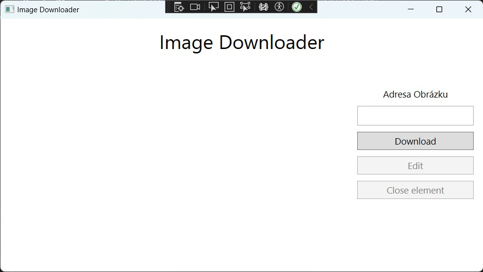
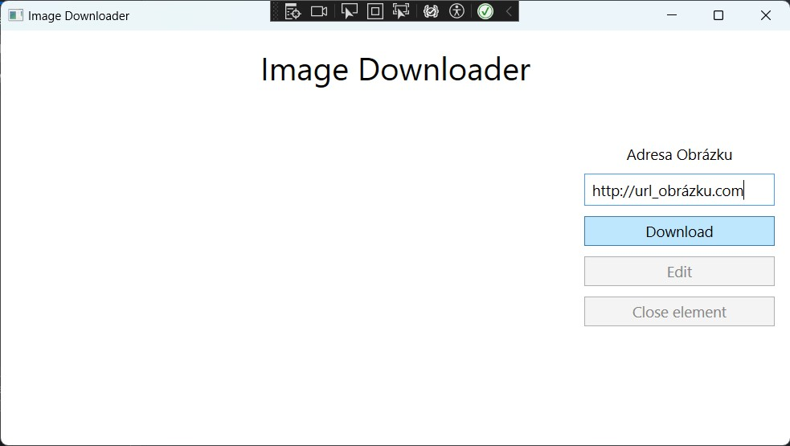

# WPF Async Project

# Image Downloader

## Assignment:
- Create an application that when you enter the url of an image, it starts downloading it and saving it to a file.

## Sample:

- Application layout
---

- Enter image url
---

- Creating the element representing the download
---

- End download and remove element
---

## Functionality layout
### Classes:
- DownloadTask (Client) - asynchronous downloading from the Internet
- DownloadElement - Wrapper class with visualization
- MainWindow - ...
---


- Linking classes
---

## Creating an application
1. **XAML design**

- First, let's do some simple XAML design. It can be arbitrary, but it must satisfy:
  - 1 **`StackPanel`** for the generated **`DownloadElements`**
  - 1 **`TextBox`** for entering the url address
  - 2 **`Buttons`** for 'Download' and 'Finalize'

- My solution has this design:
  - 2 **`Grids`**
  - 2 **`StackPanels`**
  - 3 **`Buttons`**
  - 1 **`TextBox`**
  - 1 **`Label`**

- Solution:

```xml
<Grid Margin="10,10,10,10">
	<Grid.RowDefinitions>
		<RowDefinition Height="auto"/>
		<RowDefinition Height="*"/>
	</Grid.RowDefinitions>

	<Label Grid.Row="0" Content="Image Downloader" HorizontalContentAlignment="Center" FontSize="32"/>

	<Grid Grid.Row="1">
		<Grid.ColumnDefinitions>
			<ColumnDefinition Width="*"/>
			<ColumnDefinition Width="auto"/>
		</Grid.ColumnDefinitions>
		
		<StackPanel x:Name="stackPanel_downloadElems" Grid.Column="0" MinWidth="200">

			<!-- List of downloading elements -->

		</StackPanel>

		<StackPanel Grid.Column="1" Width="200" MinWidth="100" MaxWidth="200" Height="250">

			<!-- Controling elements -->
			
			<Label Content="Adresa Obrázku" HorizontalAlignment="Center" FontSize="15"/>
			<TextBox x:Name="textBox_downLink" Margin="5" Height="auto" FontSize="15" Padding="5"/>
			<Button Content="Download" Click="InitiateDownload" Margin="5" Height="30" FontSize="15"/>
			<Button x:Name="ButtonEdit" Content="Edit" IsEnabled="False" Margin="5" Height="30" FontSize="15"/>
			<Button x:Name="ButtonFinalize" Content="Close element" IsEnabled="False" Margin="5" Height="30" FontSize="15"/>

		</StackPanel>
	</Grid>
</Grid>
```
---

2. **Defining classes**

- In the application we will use 2 custom classes **`DownloadTask`** and **`DownloadElement`**. We will define their backend interface.

  - The **`DownloadTask`** will contain a `HttpClient`, a `List` with observers (only one in this case), a url link from which we download as a `string`, the resulting file also as a `string` and an `int` of size one chunk.

  - The **`DownloadElement`** will inherit from the `ToggleButton` class and will contain an instance of `DownloadTask`, a `MainWindow` link to the main window and the following elements to work with: `ProgressBar`, `TextBox`, `Slider` and `Label`.

- Solution:
  - DownloadTask
```c#
public class ImageDownloadTask
{
	HttpClient downloadClient;

	List<DownloadElement> observers = new List<DownloadElement>();

	public string downLink { get; private set; }

	public string targetFile { get; private set; }

	int chunkSize;

	public string state { get; private set; } = "inprogress";

}
```

  - DownloadElement
```c#
public class DownloadElement : ToggleButton
{
	public ImageDownloadTask downloadTask { get; private set; }

	ProgressBar progressBar;

	TextBox limitTextBox;

	Slider limitSlider;

	Label linkLabel;

	MainWindow parentWindow;

}
```
---

3. **Class Constructors**

- Now we will create constructors for both classes.

  - The **`DownloadTask`** will create an instance of `HttpClient` in the constructor and set the attributes according to the parameters taken: 
	+ `string` url of the image path
	+ `string` path for the output file
	+ `int` chunkSize, which defaults to =10


  - ** **`DownloadElement`** in the constructor will set various parameters for its own (ToggleButton), but also for elements outside. These elements will follow this xaml schema:

```xml
<ToggleButton BorderThickness="2" Height="50" Margin="10">
	<StackPanel Orientation="Horizontal">
		<Label Content="URL download link" MaxWidth="200" Margin="5"/>
		<Label Content="Down limit:" Margin="5,5,0,5"/>
		<TextBox Text="10" Width="40" Height="20" Margin="0,5,0,5" TextChanged="LimitTextBox_TextChanged"/>
		<Label Content="KB/s" Margin="0,5,5,5"/>
		<Slider Minimum="1" Maximum="1000" Value="10" Width="50" Height="20" Margin="5" ValueChanged="LimitSlider_ValueChanged"/>
		<ProgressBar MinWidth="25" Width="100" Minimum="0" Maximum="1" Height="20" Margin="5"/>
	</StackPanel>
</ToggleButton>
``` 
  - and will take these parameters:
	+ `DownloadTask`
	+ `MainWindow`

- Solution:
  - DownloadTask
```c#
public ImageDownloadTask(string downLink, string targetFile, int chunkSize = 10)
{
	this.downloadClient = new HttpClient();
	this.chunkSize = chunkSize;
	this.downLink = downLink;
	this.targetFile = targetFile;
}
```

  - DownloadElement
```c#
public DownloadElement(ImageDownloadTask downloadTask, MainWindow parentWindow)
{
    // Toggle element (Download element) properties:
    BorderThickness = new Thickness(2);
    Height = 50;
    Margin = new Thickness(10);

    // Actions:
    Checked += ThisChecked;
    Unchecked += ThisUnchecked;

    //----------------------------------------------------------------------------------------
    this.parentWindow = parentWindow;

    var stackPanel = new StackPanel { Orientation = Orientation.Horizontal };

    linkLabel = new Label { Content = downloadTask.downLink, MaxWidth = 200, Margin = new Thickness(5) };
    stackPanel.Children.Add(linkLabel);

    var downLimitLabel = new Label { Content = "Down limit:", Margin = new Thickness(5, 5, 0, 5) };
    stackPanel.Children.Add(downLimitLabel);

    // Textbox for download speed
    limitTextBox = new TextBox { Text = "10", Width = 40, Height = 20, Margin = new Thickness(0, 5, 0, 5) };
    //limitTextBox.TextChanged += LimitTextBox_TextChanged;
    stackPanel.Children.Add(limitTextBox);

    var unitLabel = new Label { Content = "KB/s", Margin = new Thickness(0, 5, 5, 5) };
    stackPanel.Children.Add(unitLabel);

    // Slider for download speed
    limitSlider = new Slider { Minimum = 1, Maximum = 1_000, Value = 10, Width = 50, Height = 20, Margin = new Thickness(5) };
    //limitSlider.ValueChanged += LimitSlider_ValueChanged;
    stackPanel.Children.Add(limitSlider);

    // ProgressBar to show progress of the download
    progressBar = new ProgressBar { MinWidth = 25, Width = 100, Minimum = 0, Maximum = 1, Height = 20, Margin = new Thickness(5) };
    stackPanel.Children.Add(progressBar);

    Content = stackPanel;

}
```
---

4. **Connections**

- Now we need to connect these two classes in some clever way so that they can communicate with each other. In the **`DownloadTask`** class, there is a space for the **`DownloadElement`** observer and in the **`DownloadElement`** class, there is an instance of the **`DownloadTask`** class in the constructor. So let's just simply combine the two.

- Add a method to the **`DownloadTask`** class to add it to the list of observers and call it in **`DownloadElement`**.

- Solution:
  - DownloadTask
```c#
public void AddObserver(DownloadElement observer) =>
	observers.Add(observer);
```

  - DownloadElement
```c#
this.downloadTask = downloadTask;
downloadTask.AddObserver(this);
```

5. **DownloadTask Download**

- We will create a method of the DownloadTask class that will include most of the asynchronous functionality.
- The method will check: 
  + whether the connection to the url was successful
  + whether the url matches
  + and whether it is an image url

- This application will also handle the limitation of the download speed of individual images, to better demonstrate asynchronicity.

- Content of the method
  + Attempt to establish a connection via `HttpClient` and check the response.
  + Then declaring the variables that will be needed during the download.
  + The logical part of downloading and writing to a file

- The download will also count how fast the chunk downloaded and how long to wait until the second to meet the download speed via the following complex formula. $1 \text{ s} = downloadTime \text{ s} + (1 - downloadTime \text{ s})$

- Solution:
```c#
public async Task Download()
{
    // Exceptions checking
    HttpResponseMessage? response;

    try
    {
        response = await downloadClient.GetAsync(downLink, HttpCompletionOption.ResponseHeadersRead);
    }
    catch
    {
        state = "failed";
        return;
    }
    
    if (!response.IsSuccessStatusCode)
    {
        MessageBox.Show($"Invalid image link\nWeb response: {response.StatusCode}");
        state = "failed";
        return;
    }

    if (!response.Content.Headers.ContentType.ToString().Contains("image"))
    {
        MessageBox.Show("Given url is not an image url.");
        state = "failed";
        return;
    }

    // Declaring variables
    long totalImgSize = response.Content.Headers.ContentLength ?? -1;

    bool canReportState = false;

    if (totalImgSize != -1)
        canReportState = true;

    long totalBytesRead = 0;

    var buffer = new byte[this.chunkSize * updateMulitplier];
    int bytesRead;

    var chunkTimeStart = Stopwatch.StartNew();

    // Logic
    try
    {
        using (var contentStream = await response.Content.ReadAsStreamAsync())
        using (var fileStream = new FileStream(targetFile, FileMode.Create, FileAccess.Write, FileShare.None, 4096, true))
        {

            while ((bytesRead = await contentStream.ReadAsync(buffer, 0, buffer.Length)) > 0)
            {
                chunkTimeStart.Restart();

                await fileStream.WriteAsync(buffer, 0, bytesRead);
                totalBytesRead += bytesRead;

                if (chunkSize != buffer.Length)
                    buffer = new byte[this.chunkSize * updateMulitplier];


                //if (canReportState)
                    //UpdateProgress((double)totalBytesRead / totalImgSize);

                await Task.Delay(int.Max(0, (1000 * updateMulitplier) - (int)chunkTimeStart.ElapsedMilliseconds));
            }

            state = "finished";
        }
    }

    catch
    {
        state = "failed";
    }

}
```


6. **Can't touch this**

- So far everything we have created is not tangible and we will go to `MainWindow` and add a little something there.
- We'll create variables for `Buttons`: Edit and Finalize and then give `Button Download` its functionality. The `Button` when pressed will see if there is any text in the `TextBox` and if not it will do nothing. If there is it finds out how many `DownloadElements` are in the `StackPanel` and if there are less than 5 it continues.
- This is followed by a save window where the user chooses where to save the image.
- Instances of `DownloadTask` and `DownloadElement` are created and the download is started via Task.Run()

- Solution:
```c#
public partial class MainWindow : Window
{
    // Store references to finalize and edit buttons
    public Button button_FinalizeDownload { get; private set; }
    public Button button_EditImage { get; private set; }

    public MainWindow()
    {
        InitializeComponent();

        // Assign buttons from XAML to properties
        button_FinalizeDownload = ButtonFinalize;
        button_EditImage = ButtonEdit;
    }

    private void InitiateDownload(object sender, RoutedEventArgs e)
    {
        if (string.IsNullOrWhiteSpace(textBox_downLink.Text)) return;

        if (stackPanel_downloadElems.Children.Count >= 5)
        {
            MessageBox.Show("You can download only 5 images at once.", "Max downloads", MessageBoxButton.OK, MessageBoxImage.Warning);
            return;
        }


        var saveDialog = new SaveFileDialog();
        saveDialog.Filter = "JPEG Image|*.jpg";

        if (saveDialog.ShowDialog() == true)
        {
            var downloadTask = new ImageDownloadTask(textBox_downLink.Text, saveDialog.FileName);

            // Create a new instance of DownloadElement
            DownloadElement newDownloadElement = new DownloadElement(downloadTask, this);

            Task.Run(() => newDownloadElement.downloadTask.Download());

            // Add child element to StackPanel element
            stackPanel_downloadElems.Children.Add(newDownloadElement);

            // Clear TextBox element
            textBox_downLink.Text = "";
        }

    }
```


7. **Progres**

- Teď se nám vytvořil element a snad se i začlo stahovat, ale nelze to říci, ikdybychom čekali 10 minut při stahování obrázku 100x100.
- V `DownloadTask` si vytvoříme metodu `UpdateProgress`, která zavolá stejnojmennou metodu každého observera (jenom jednoho), která už upraví Value v `progressBaru`.
- Poté můžeme dodat do download metody 'if can report, report'

- Řešení:
  - DownloadTask
```c#
private void UpdateProgress(double value)
{
    foreach (var observer in observers)
        observer.UpdateProgress(value);
}
```
a
```c#
if (chunkSize != buffer.Length)			//old code
	buffer = new byte[this.chunkSize * updateMulitplier];  //old code


if (canReportState)   //new code
	UpdateProgress((double)totalBytesRead / totalImgSize); //new code

await Task.Delay(int.Max(0, (1000 * updateMulitplier) - (int)chunkTimeStart.ElapsedMilliseconds));  //old code
```

  - DownloadElement
```c#
public void UpdateProgress(double value)
{
    Application.Current.Dispatcher.Invoke(() =>
    {
        progressBar.Value = value;
    });
}
```

8. **Limit**

- Now the `ProgressBar` is loading, but it is somehow slow. Some nerd set the base download speed to 10 KB/s. 
- First, let's link the behavior of `Slider` and `TextBox` in `DownloadElement`. For both of these elments, we create a method that is called when the value changes and modifies the value of the other element.
- These methods pass the value of the `TextBox` (TextBox > Slider) to the `ChangeLimiter` method in the `DownloadTask` class, which changes the chunkSize attribute.

 - Solution:
  - DownloadTask
```c#
public void ChangeLimiter(int new_limit) =>
	this.chunkSize = new_limit;
```

  - DownloadElement
```c#
private void LimitTextBox_TextChanged(object sender, TextChangedEventArgs e)
{
	if (int.TryParse(limitTextBox.Text, out int value))
	{
		limitSlider.Value = value;
		downloadTask.ChangeLimiter(value);
	}
}

private void LimitSlider_ValueChanged(object sender, RoutedPropertyChangedEventArgs<double> e)
{
	limitTextBox.Text = Math.Round(limitSlider.Value, 0).ToString();
	downloadTask.ChangeLimiter(int.Parse(limitTextBox.Text));
}
```
a
```c#
// Textbox for download speed
limitTextBox = new TextBox { Text = "10", Width = 40, Height = 20, Margin = new Thickness(0, 5, 0, 5) };  //old code
limitTextBox.TextChanged += LimitTextBox_TextChanged;   //new code
stackPanel.Children.Add(limitTextBox);   //old code

...

// Slider for download speed
limitSlider = new Slider { Minimum = 1, Maximum = 1_000, Value = 10, Width = 50, Height = 20, Margin = new Thickness(5) };   //old code
limitSlider.ValueChanged += LimitSlider_ValueChanged;  //new code
stackPanel.Children.Add(limitSlider);   //old code
```

9. **Too many**

- No code is perfect, but we can get a little closer (very, very little). 
- Now we'll make sure that multiple `DownloadElements` can't be checked at once.
- We'll insert the `Check` and `Uncheck` methods into the `DownloadElement` we tried to get to earlier.
- And in the `MainWindow` we create a `SingleToggle` method that when called, will go through the `Stackpanel` elements and uncheck them.

 - Solution:
  - DownloadElement
```c#
private void ThisChecked(object sender, RoutedEventArgs e)
{
	parentWindow.SingleToggle(sender);

	if (downloadTask.state == "finished")
	{
		parentWindow.button_EditImage.IsEnabled = true;
		parentWindow.button_EditImage.Click += EditImage;

		parentWindow.button_FinalizeDownload.IsEnabled = true;
		parentWindow.button_FinalizeDownload.Content = "Close finished";
		parentWindow.button_FinalizeDownload.Click += FinalizeDownload;
	}
	else if (downloadTask.state == "fail")
	{
		parentWindow.button_FinalizeDownload.IsEnabled = true;
		parentWindow.button_FinalizeDownload.Content = "Close unfinished";
		parentWindow.button_FinalizeDownload.Click += FinalizeDownload;
	}
}


private void ThisUnchecked(object sender, RoutedEventArgs e)
{
	parentWindow.button_EditImage.IsEnabled = false;
	parentWindow.button_EditImage.Click -= EditImage;

	parentWindow.button_FinalizeDownload.IsEnabled = false;
	parentWindow.button_FinalizeDownload.Content = "Close element";
	parentWindow.button_FinalizeDownload.Click -= FinalizeDownload;
}
```

  - MainWindow
```c#
public void SingleToggle(object sender)
{
	var toggledButton = sender as ToggleButton;
	foreach (var child in stackPanel_downloadElems.Children)
		if (child is DownloadElement downloadElement && downloadElement != toggledButton && downloadElement.IsChecked == true)
			downloadElement.IsChecked = false;
}
```


10. **On the way to the final**

- We're a little way from the functionality we'd like.
- Now we need some way to know that the download is complete. To do this, we will have `OnFail` `OnFinish` methods in the `DownloadElement` class that will visually display the status that the download has reached.
- We will also add two methods in the `DownloadTask` class, `NotifyFail` and `NotifyFinish`, which will call the `OnFail` and `OnFinish` functions.
- A call to one of these methods will be added to the Download method for each state value retrieval.

 - Solution:
  - DownloadTask
```c#
private void NotifyFail()
{
	foreach (var observer in observers)
		observer.OnFail();
}

private void NotifyFinish()
{
	foreach (var observer in observers)
		observer.OnFinish();
}
```
a
```c#
public async Task Download()
{
    // Exceptions checking
    HttpResponseMessage response;

    try
    {
        response = await downloadClient.GetAsync(downLink, HttpCompletionOption.ResponseHeadersRead);
    }
    catch
    {
        NotifyFail(); //new code
        state = "failed";
        return;
    }
    
    if (!response.IsSuccessStatusCode)
    {
        MessageBox.Show($"Invalid image link\nWeb response: {response.StatusCode}");
        NotifyFail();      //new code
        state = "failed";
        return;
    }

    if (!response.Content.Headers.ContentType.ToString().Contains("image"))
    {
        MessageBox.Show("Given url is not an image url.");
        NotifyFail();     //new code
        state = "failed";
        return;
    }

    // Declaring variables
    long totalImgSize = response.Content.Headers.ContentLength ?? -1;

    bool canReportState = false;

    if (totalImgSize != -1)
        canReportState = true;

    long totalBytesRead = 0;

    var buffer = new byte[this.chunkSize * updateMulitplier];
    int bytesRead;

    var chunkTimeStart = Stopwatch.StartNew();

    // Logic
    try
    {
        using (var contentStream = await response.Content.ReadAsStreamAsync())
        using (var fileStream = new FileStream(targetFile, FileMode.Create, FileAccess.Write, FileShare.None, 4096, true))
        {

            while ((bytesRead = await contentStream.ReadAsync(buffer, 0, buffer.Length)) > 0)
            {
                chunkTimeStart.Restart();

                await fileStream.WriteAsync(buffer, 0, bytesRead);
                totalBytesRead += bytesRead;

                if (chunkSize != buffer.Length)
                    buffer = new byte[this.chunkSize * updateMulitplier];


                if (canReportState)
                    UpdateProgress((double)totalBytesRead / totalImgSize);

                await Task.Delay(int.Max(0, (1000 * updateMulitplier) - (int)chunkTimeStart.ElapsedMilliseconds));
            }

            state = "finished";
            NotifyFinish();    //new code
        }
    }

    catch
    {
        state = "failed";
        NotifyFail();    //new code
    }
        
}
```

  - DownloadElement
```c#
public void OnFail()
{
	Application.Current.Dispatcher.Invoke(() =>
	{
		BorderBrush = Brushes.Red;
		
	});
}

public void OnFinish()
{
	Application.Current.Dispatcher.Invoke(() =>
	{
		BorderBrush = Brushes.Green;
	});
}
```

11. **Ending**

- We're at the end and the only thing left is to clean up nicely.
- Let's create the `FinalizeDownload` and `EditImage` methods that the check methods were stripped of. 
- The first method will call `uncheck` and call a new method in `MainWindow`, and the second method will render a `MessageBox` with the text "Edit here".
- The new method in the `MainWindow` is `RemoveDownElement` and removes from the `StackPanel` its descendant that called the method.

 - Solution:
  - DownloadElement
```c#
private void FinalizeDownload(object sender, RoutedEventArgs e)
{
	ThisUnchecked(this, e);
	parentWindow.RemoveDownElement(this);
}


private void EditImage(object sender, RoutedEventArgs e)
{
	// Your EditImage logic here
	MessageBox.Show("Edit here");
}
```

  - MainWindow
```c#
public void RemoveDownElement(object sender)
{
	stackPanel_downloadElems.Children.Remove((UIElement)sender);
}
```

### Interesting notes

- **Creating xml elements in C#**
	- In WPF, you can edit xml elements while the program is running, but you can also add new ones. *(Part of the `System.Windows.Controls` module)* 

- **?? operator**
	- The '??' is a null-coalescing operator that converts a null value to some default value. It allows fast conversion from a type with a null value to a type without a null value. `set: int? num = null` `get: num = null` -> `set: int num = null ?? 0` `get: num = 0`

- **condition ? expression1 : expression2**
	- ternary operator. If the condition is satisfied, `expression1` is returned, if not then `expression2` is returned.